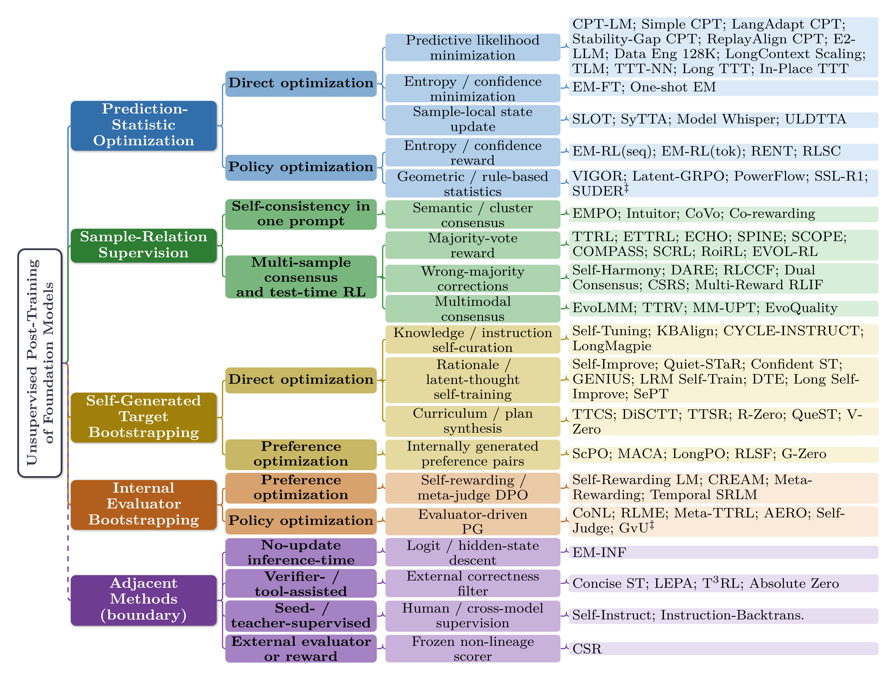

<h1 align="center">📚 Unsupervised Post-Training of Foundation Models</h1>
<h3 align="center">Companion Inventory · A Survey</h3>

<p align="center">
  <em>Audit-trail companion for the survey</em><br>
  <strong><em>"Unsupervised Post-Training of Foundation Models: A Survey"</em></strong>
  <br><sub>EMNLP 2026 submission</sub>
</p>

<p align="center">
  <a href="#-strict-upt-methods"></a>
  <a href="#-adjacent-methods-8"></a>
  <a href="#-prose-only-mentions-6"></a>
  <a href="read/"></a>
  <a href="pdfs/"></a>
  <br>
  <a href="#license"></a>
  
  
  
  <a href="https://awesome.re"></a>
</p>

<p align="center"><strong>English</strong> · <a href="README_zh.md">简体中文</a></p>

---

## ✨ TL;DR

A curated, audit-grade inventory of every paper our survey classifies as **strict Unsupervised Post-Training (UPT)** of foundation models — *plus* a transparent record of every adjacent and borderline case we considered.

UPT = post-pretraining procedures that **update model parameters / adapters / memories** from **unlabeled inputs and same-model-lineage signals only**, with **no external supervision** (no human labels, ground-truth answers, verifier feedback, tool execution, or stronger-teacher distillation).

Use this companion to:
- 🔎 Browse all 80 strict UPT methods, grouped by their **internal update object** (4 families).
- 🧭 See exactly *why* each adjacent paper was routed out (which boundary check fails).
- 📖 Read a 1–2-page rationale for any cited paper in `read/<bibkey>.md`, with its PDF in `pdfs/<bibkey>.pdf`.
- 📊 Cross-check the row counts against the main-paper tables.

<p align="center">
  
  <br>
  <sub><em>Update-object taxonomy. Four strict UPT families plus the dashed Adjacent Methods branch. Bridge cases marked with <code>‡</code>. Reproduces Appendix Figure A1 of the main paper.</em></sub>
</p>

## 📑 Table of Contents

- [TL;DR](#-tldr)
- [Coverage at a glance](#-coverage-at-a-glance)
- [Boundary checks (B1–B4)](#-boundary-checks-b1b4)
- [Strict UPT methods](#-strict-upt-methods)
  - [Family I — Prediction-Statistic Optimization](#-family-i--prediction-statistic-optimization-25)
  - [Family I/IV bridge](#-family-iiv-bridge-1)
  - [Family II — Sample-Relation Supervision](#-family-ii--sample-relation-supervision-22)
  - [Family III — Self-Generated Target Bootstrapping](#-family-iii--self-generated-target-bootstrapping-22)
  - [Family IV — Internal Evaluator Bootstrapping](#-family-iv--internal-evaluator-bootstrapping-10)
- [Adjacent methods (8)](#-adjacent-methods-8)
- [Prose-only mentions (6)](#-prose-only-mentions-6)
- [Timing-of-adaptation view](#-timing-of-adaptation-view)
- [Repository layout](#-repository-layout)
- [Field schema](#-field-schema)
- [Screening protocol](#-screening-protocol)
- [Row-count reconciliation](#-row-count-reconciliation-with-the-main-paper)
- [Boundary-audit highlights](#-boundary-audit-highlights)
- [Contributing & living-document policy](#-contributing--living-document-policy)
- [License](#-license)

## 📊 Coverage at a glance

| Bucket | Count | What it is |
|--------|------:|------------|
| **Strict UPT** | **80** | Pass all four boundary checks B1–B4 |
| ↳ Family I (Prediction-Statistic Optimization) | 25 + 1 ‡ bridge | NLL / entropy / confidence / geometric statistics |
| ↳ Family II (Sample-Relation Supervision) | 22 | Multi-sample consensus / majority vote / cluster |
| ↳ Family III (Self-Generated Target Bootstrapping) | 22 | Self-curated instructions / rationales / preference pairs |
| ↳ Family IV (Internal Evaluator Bootstrapping) | 10 | Self-judge / meta-judge / evaluator-driven RL |
| **Adjacent** | 8 | Fail at least one of B1–B4; kept for traceability |
| **Prose-only** | 6 | Named only in paper prose / forest figure |
| **Per-method notes** (`read/`) | 91 | One rationale per cited paper |
| **PDFs** (`pdfs/`) | 91 | One PDF per cited paper |

## ✅ Boundary checks (B1–B4)

A method is **strict UPT** iff *all four* of these hold (verbatim from §2 of the main paper):

| # | Check | Plain English |
|---|-------|---------------|
| **B1** | Explicit update | The method updates parameters / adapters / memories / persistent local state. |
| **B2** | Internal signal | Update signal is computed only from unlabeled inputs and same-model-lineage samples or judgments. |
| **B3** | No external supervision | No ground-truth answers, verifier feedback, tool/code execution verdicts, human labels, or stronger-teacher labels. |
| **B4** | Internal evaluator | Any judge / scorer / reward model used in the update is itself from the same model lineage. |

Methods that fail any check are routed to **adjacent** (kept in the inventory, *not* deleted) with the failing check recorded.

## 🧩 Strict UPT methods

> Each row links to a 1–2-page rationale (`read/<bibkey>.md`) and the paper PDF (`pdfs/<bibkey>.pdf`). Tables match Tables 1–4 of the main paper row-for-row.

### 🟦 Family I — Prediction-Statistic Optimization (25)

**Update object:** a single-observation scalar from the model — token NLL, sequence likelihood, entropy, confidence, or another geometric / rule-based statistic.

<details open>
<summary><strong>Methods (click to collapse)</strong></summary>

| Method | Venue | Update target | Notes | PDF |
|--------|-------|---------------|-------|-----|
| **CPT-LM** | arXiv 2023 | parameters | [read](read/ke2023cptlm.md) | [pdf](pdfs/ke2023cptlm.pdf) |
| **Simple CPT** | arXiv 2024 | parameters | [read](read/qian2024simplescalable.md) | [pdf](pdfs/qian2024simplescalable.pdf) |
| **LangAdapt CPT** | ACL 2025 | parameters | [read](read/elhady2025languageadapt.md) | [pdf](pdfs/elhady2025languageadapt.pdf) |
| **Stability-Gap CPT** | ACL 2025 | parameters | [read](read/guo2025stabilitygap.md) | [pdf](pdfs/guo2025stabilitygap.pdf) |
| **ReplayAlign CPT** | NeurIPS 2025 Workshop | parameters | [read](read/abbes2025replayalign.md) | [pdf](pdfs/abbes2025replayalign.pdf) |
| **E2-LLM** | ACL Findings 2024 | parameters | [read](read/liu2024e2llm.md) | [pdf](pdfs/liu2024e2llm.pdf) |
| **Data Eng 128K** | arXiv 2024 | parameters | [read](read/fu2024dataengineering.md) | [pdf](pdfs/fu2024dataengineering.pdf) |
| **LongContext Scaling** | arXiv 2023 | parameters | [read](read/xiong2024longcontext.md) | [pdf](pdfs/xiong2024longcontext.pdf) |
| **TLM** | ICML 2025 | parameters | [read](read/hu2025test.md) | [pdf](pdfs/hu2025test.pdf) |
| **TTT-NN** | ICLR 2024 | parameters | [read](read/jang2024tttnn.md) | [pdf](pdfs/jang2024tttnn.pdf) |
| **Long TTT** | arXiv 2025 | parameters | [read](read/bansal2026qttt.md) | [pdf](pdfs/bansal2026qttt.pdf) |
| **In-Place TTT** | ICLR 2026 | parameters | [read](read/feng2026inplace.md) | [pdf](pdfs/feng2026inplace.pdf) |
| **EM-FT** | NeurIPS 2025 | parameters | [read](read/agarwal2025unreasonable.md) | [pdf](pdfs/agarwal2025unreasonable.pdf) |
| **One-shot EM** | arXiv 2025 | parameters | [read](read/gao2025oneshot.md) | [pdf](pdfs/gao2025oneshot.pdf) |
| **EM-RL(seq)** | NeurIPS 2025 | parameters | [read](read/agarwal2025unreasonable.md) | [pdf](pdfs/agarwal2025unreasonable.pdf) |
| **EM-RL(tok)** | NeurIPS 2025 | parameters | [read](read/agarwal2025unreasonable.md) | [pdf](pdfs/agarwal2025unreasonable.pdf) |
| **RENT** | arXiv 2025 | parameters | [read](read/prabhudesai2025rent.md) | [pdf](pdfs/prabhudesai2025rent.pdf) |
| **RLSC** | arXiv 2025 | parameters | [read](read/li2025rlsc.md) | [pdf](pdfs/li2025rlsc.pdf) |
| **SLOT** | arXiv 2025 | sample-local state | [read](read/hu2025slot.md) | [pdf](pdfs/hu2025slot.pdf) |
| **SyTTA** | arXiv 2025 | sample-local state (LoRA) | [read](read/xu2025you.md) | [pdf](pdfs/xu2025you.pdf) |
| **Model Whisper** | arXiv 2025 | sample-local state (steering) | [read](read/kang2025modelwhisper.md) | [pdf](pdfs/kang2025modelwhisper.pdf) |
| **ULDTTA** | arXiv 2026 | sample-local state (layer-wise) | [read](read/xu2026uldtta.md) | [pdf](pdfs/xu2026uldtta.pdf) |
| **VIGOR** | arXiv 2026 | parameters | [read](read/wen2026verifierfreerlllmsintrinsic.md) | [pdf](pdfs/wen2026verifierfreerlllmsintrinsic.pdf) |
| **Latent-GRPO** | arXiv 2026 | parameters | [read](read/zhang2026silencejudgereinforcementlearning.md) | [pdf](pdfs/zhang2026silencejudgereinforcementlearning.pdf) |
| **SSL-R1** | arXiv 2026 | parameters | [read](read/xie2026sslr1selfsupervisedvisualreinforcement.md) | [pdf](pdfs/xie2026sslr1selfsupervisedvisualreinforcement.pdf) |

</details>

### 🔄 Family I/IV bridge (1)

**Bridge:** the method has primary signature of Family I but secondary internal-evaluator characteristics; marked `‡` in main-paper tables.

| Method | Venue | Update target | Notes | PDF |
|--------|-------|---------------|-------|-----|
| **SUDER** | arXiv 2025 | parameters | [read](read/hong2025suderselfimprovingunifiedlarge.md) | [pdf](pdfs/hong2025suderselfimprovingunifiedlarge.pdf) |

### 🟩 Family II — Sample-Relation Supervision (22)

**Update object:** a relation across multiple internal samples — majority vote, semantic cluster, self-certainty, path consistency, or pairwise agreement.

<details open>
<summary><strong>Methods (click to collapse)</strong></summary>

| Method | Venue | Update target | Notes | PDF |
|--------|-------|---------------|-------|-----|
| **EMPO** | arXiv 2025 | parameters | [read](read/zhang2025rightquestion.md) | [pdf](pdfs/zhang2025rightquestion.pdf) |
| **Intuitor** | ICLR 2026 | parameters | [read](read/zhao2025intuitor.md) | [pdf](pdfs/zhao2025intuitor.pdf) |
| **CoVo** | arXiv 2025 | parameters | [read](read/zhang2025covo.md) | [pdf](pdfs/zhang2025covo.pdf) |
| **Co-rewarding** | ICLR 2026 | parameters | [read](read/zhang2026corewarding.md) | [pdf](pdfs/zhang2026corewarding.pdf) |
| **EvoLMM** | arXiv 2025 | parameters | [read](read/thawakar2025evolmm.md) | [pdf](pdfs/thawakar2025evolmm.pdf) |
| **TTRL** | NeurIPS 2025 | parameters | [read](read/zuo2025ttrl.md) | [pdf](pdfs/zuo2025ttrl.pdf) |
| **ETTRL** | arXiv 2025 | parameters | [read](read/liu2025ettrl.md) | [pdf](pdfs/liu2025ettrl.pdf) |
| **ECHO** | arXiv 2026 | parameters | [read](read/zhao2026echo.md) | [pdf](pdfs/zhao2026echo.pdf) |
| **SPINE** | arXiv 2025 | parameters | [read](read/wu2025spine.md) | [pdf](pdfs/wu2025spine.pdf) |
| **Self-Harmony** | ICLR 2026 | parameters | [read](read/wang2026selfharmony.md) | [pdf](pdfs/wang2026selfharmony.pdf) |
| **DARE** | arXiv 2026 | parameters | [read](read/du2026dare.md) | [pdf](pdfs/du2026dare.pdf) |
| **SCOPE** | arXiv 2025 | parameters | [read](read/wang2025scope.md) | [pdf](pdfs/wang2025scope.pdf) |
| **COMPASS** | arXiv 2025 | parameters | [read](read/xing2025compass.md) | [pdf](pdfs/xing2025compass.pdf) |
| **SCRL** | arXiv 2026 | parameters | [read](read/yan2026scrl.md) | [pdf](pdfs/yan2026scrl.pdf) |
| **RLCCF** | arXiv 2025 | parameters | [read](read/yuan2025rlccf.md) | [pdf](pdfs/yuan2025rlccf.pdf) |
| **RoiRL** | NeurIPS 2025 Workshop | parameters | [read](read/arzhantsev2025roirl.md) | [pdf](pdfs/arzhantsev2025roirl.pdf) |
| **EVOL-RL** | arXiv 2025 | parameters | [read](read/zhou2025evolrl.md) | [pdf](pdfs/zhou2025evolrl.pdf) |
| **TTRV** | arXiv 2025 | parameters | [read](read/singh2025ttrv.md) | [pdf](pdfs/singh2025ttrv.pdf) |
| **MM-UPT** | NeurIPS 2025 | parameters | [read](read/wei2025mmupt.md) | [pdf](pdfs/wei2025mmupt.pdf) |
| **Dual Consensus** | arXiv 2026 | parameters | [read](read/du2026dualconsensusescapingspurious.md) | [pdf](pdfs/du2026dualconsensusescapingspurious.pdf) |
| **CSRS** | arXiv 2026 | parameters | [read](read/yu2026stabilizingunsupervisedselfevolutionmllms.md) | [pdf](pdfs/yu2026stabilizingunsupervisedselfevolutionmllms.pdf) |
| **EvoQuality** | ICLR 2026 | parameters | [read](read/wen2026selfevolvingvisionlanguagemodelsimage.md) | [pdf](pdfs/wen2026selfevolvingvisionlanguagemodelsimage.pdf) |

</details>

### 🟨 Family III — Self-Generated Target Bootstrapping (22)

**Update object:** a synthetic target the model constructs for itself — instruction, rationale, curriculum, debate trace, or preference pair — then trained against with SFT / DPO.

<details open>
<summary><strong>Methods (click to collapse)</strong></summary>

| Method | Venue | Update target | Notes | PDF |
|--------|-------|---------------|-------|-----|
| **Self-Tuning** | ACL Findings 2025 | parameters | [read](read/zhang2025selftuning.md) | [pdf](pdfs/zhang2025selftuning.pdf) |
| **KBAlign** | EMNLP Findings 2025 | parameters | [read](read/zeng2025kbalign.md) | [pdf](pdfs/zeng2025kbalign.pdf) |
| **CYCLE-INSTRUCT** | EMNLP 2025 | parameters | [read](read/shen2025cycleinstruct.md) | [pdf](pdfs/shen2025cycleinstruct.pdf) |
| **Self-Improve** | EMNLP 2023 | parameters | [read](read/huang2023selfimprove.md) | [pdf](pdfs/huang2023selfimprove.pdf) |
| **Quiet-STaR** | arXiv 2024 | parameters | [read](read/zelikman2024quietstar.md) | [pdf](pdfs/zelikman2024quietstar.pdf) |
| **Confident ST** | EMNLP Findings 2025 | parameters | [read](read/wang2025confidentreasoning.md) | [pdf](pdfs/wang2025confidentreasoning.pdf) |
| **GENIUS** | arXiv 2025 | parameters | [read](read/xu2025genius.md) | [pdf](pdfs/xu2025genius.pdf) |
| **LRM Self-Train** | arXiv 2025 | parameters | [read](read/shi2025lrmselftrain.md) | [pdf](pdfs/shi2025lrmselftrain.pdf) |
| **DTE** | EMNLP 2025 | parameters | [read](read/liu2025dte.md) | [pdf](pdfs/liu2025dte.pdf) |
| **LongMagpie** | arXiv 2025 | parameters | [read](read/gao2025longmagpie.md) | [pdf](pdfs/gao2025longmagpie.pdf) |
| **Long Self-Improve** | arXiv 2024 | parameters | [read](read/wang2024longselfimprove.md) | [pdf](pdfs/wang2024longselfimprove.pdf) |
| **TTCS** | arXiv 2026 | parameters | [read](read/yang2026ttcs.md) | [pdf](pdfs/yang2026ttcs.pdf) |
| **DiSCTT** | arXiv 2026 | parameters | [read](read/moradi2026disctt.md) | [pdf](pdfs/moradi2026disctt.pdf) |
| **TTSR** | arXiv 2026 | parameters | [read](read/he2026ttsr.md) | [pdf](pdfs/he2026ttsr.pdf) |
| **R-Zero** | arXiv 2025 | parameters | [read](read/huang2026rzero.md) | [pdf](pdfs/huang2026rzero.pdf) |
| **ScPO** | ICML 2025 | parameters | [read](read/prasad2025scpo.md) | [pdf](pdfs/prasad2025scpo.pdf) |
| **MACA** | arXiv 2025 | parameters | [read](read/samanta2025maca.md) | [pdf](pdfs/samanta2025maca.pdf) |
| **LongPO** | ICLR 2025 | parameters | [read](read/chen2025longpo.md) | [pdf](pdfs/chen2025longpo.pdf) |
| **RLSF** | arXiv 2025 | parameters | [read](read/vanniekerk2025rlsf.md) | [pdf](pdfs/vanniekerk2025rlsf.pdf) |
| **G-Zero** | arXiv 2026 | parameters | [read](read/huang2026gzeroselfplayopenendedgeneration.md) | [pdf](pdfs/huang2026gzeroselfplayopenendedgeneration.pdf) |
| **QueST** | arXiv 2026 | sample-local state (LoRA) | [read](read/song2026queryconditionedtesttimeselftraininglarge.md) | [pdf](pdfs/song2026queryconditionedtesttimeselftraininglarge.pdf) |
| **V-Zero** | arXiv 2026 | parameters | [read](read/wang2026vzeroselfimprovingmultimodalreasoning.md) | [pdf](pdfs/wang2026vzeroselfimprovingmultimodalreasoning.pdf) |

</details>

### 🟥 Family IV — Internal Evaluator Bootstrapping (10)

**Update object:** a self-elevated *judge* (scorer / reward model / meta-judge), produced and consumed by the same lineage; the actor is trained against its verdict.

<details open>
<summary><strong>Methods (click to collapse)</strong></summary>

| Method | Venue | Update target | Notes | PDF |
|--------|-------|---------------|-------|-----|
| **Self-Rewarding LM** | ICML 2024 | parameters | [read](read/yuan2024selfrewarding.md) | [pdf](pdfs/yuan2024selfrewarding.pdf) |
| **CREAM** | ICLR 2025 | parameters | [read](read/wang2024cream.md) | [pdf](pdfs/wang2024cream.pdf) |
| **Meta-Rewarding** | arXiv 2024 | parameters | [read](read/wu2024metarewarding.md) | [pdf](pdfs/wu2024metarewarding.pdf) |
| **Temporal SRLM** | arXiv 2025 | parameters | [read](read/jin2025temporalselfrewarding.md) | [pdf](pdfs/jin2025temporalselfrewarding.pdf) |
| **CoNL** | arXiv 2026 | parameters | [read](read/sui2026conl.md) | [pdf](pdfs/sui2026conl.pdf) |
| **RLME** | arXiv 2026 | parameters | [read](read/rentschler2026rlme.md) | [pdf](pdfs/rentschler2026rlme.pdf) |
| **Meta-TTRL** | arXiv 2026 | parameters | [read](read/tan2026metattrl.md) | [pdf](pdfs/tan2026metattrl.pdf) |
| **AERO** | arXiv 2026 | parameters | [read](read/gao2026aeroautonomousevolutionaryreasoning.md) | [pdf](pdfs/gao2026aeroautonomousevolutionaryreasoning.pdf) |
| **Self-Judge** | arXiv 2026 | parameters | [read](read/wu2026modelsjudgethemselvesunsupervised.md) | [pdf](pdfs/wu2026modelsjudgethemselvesunsupervised.pdf) |
| **GvU** | CVPR 2026 | parameters | [read](read/pan2026learninggenerateunderstandingunderstandingdriven.md) | [pdf](pdfs/pan2026learninggenerateunderstandingunderstandingdriven.pdf) |

</details>

## 🚧 Adjacent methods (8)

Closely related but **fail at least one boundary check**. Kept in the inventory for traceability.

| Method | Venue | Fails | Adjacent type | Notes | PDF |
|--------|-------|-------|---------------|-------|-----|
| **EM-INF** | NeurIPS 2025 | `B1` | no update inference time | [read](read/agarwal2025unreasonable.md) | [pdf](pdfs/agarwal2025unreasonable.pdf) |
| **T3RL** | arXiv 2026 | `B3` | verifier or tool assisted | [read](read/liao2026t3rl.md) | [pdf](pdfs/liao2026t3rl.pdf) |
| **Absolute Zero** | arXiv 2025 | `B3` | verifier or tool assisted | [read](read/zhao2025absolutezero.md) | [pdf](pdfs/zhao2025absolutezero.pdf) |
| **Concise ST** | ACL Findings 2025 | `B3` | verifier or tool assisted | [read](read/wang2025concisereasoning.md) | [pdf](pdfs/wang2025concisereasoning.pdf) |
| **LEPA** | arXiv 2025 | `B3` | verifier or tool assisted | [read](read/zhang2025lepa.md) | [pdf](pdfs/zhang2025lepa.pdf) |
| **Self-Instruct** | ACL 2023 | `B3` | seed or human supervised | [read](read/wang2023selfinstruct.md) | [pdf](pdfs/wang2023selfinstruct.pdf) |
| **Instruction-Backtranslation** | arXiv 2023 | `B3` | seed or human supervised | [read](read/li2024instructionbacktranslation.md) | [pdf](pdfs/li2024instructionbacktranslation.pdf) |
| **CSR** | arXiv 2024 | `B4` | external evaluator | [read](read/zhou2024csr.md) | [pdf](pdfs/zhou2024csr.pdf) |

## 📝 Prose-only mentions (6)

Methods named only in **section prose or the forest figure**, not in the four strict-UPT tables. Kept separate so the strict count stays exactly 80.

| Method | Primary family | Mentioned at | Notes | PDF |
|--------|----------------|--------------|-------|-----|
| **PowerFlow** | F1 | §Family I prose (main.tex L796) + forest tree (L284) | [read](read/chen2026powerflowunlockingdualnature.md) | [pdf](pdfs/chen2026powerflowunlockingdualnature.pdf) |
| **Multi-Reward RLIF** | F2 | §Family II prose (main.tex L936) + forest tree (L303) | [read](read/joarder2026betteronecollapsefreemultireward.md) | [pdf](pdfs/joarder2026betteronecollapsefreemultireward.pdf) |
| **SePT** | F3 | §Family III prose (main.tex L1025) + forest tree (L320) | [read](read/li2026modelhelpitselfrewardfree.md) | [pdf](pdfs/li2026modelhelpitselfrewardfree.pdf) |
| **PonderTTT** | F1-timing | §7 Timing prose (main.tex L1215) + forest tree (L496) | [read](read/sim2026ponderttt.md) | [pdf](pdfs/sim2026ponderttt.pdf) |
| **TT-VLA** | F1-timing | §7 Timing prose (main.tex L1206) + forest tree (L482) | [read](read/liu2026ttvla.md) | [pdf](pdfs/liu2026ttvla.pdf) |
| **SECL** | F1-timing | §7 Timing prose (main.tex L1206) + forest tree (L482) | [read](read/strich2026secl.md) | [pdf](pdfs/strich2026secl.pdf) |

## ⏱️ Timing-of-adaptation view

Orthogonal to the four families: every method is independently coded along **Input Visibility × Update Persistence** (§6 of the main paper). Counts below sum to ≥ 80 because some papers contribute one entry per protocol.

| Regime | Members (count) | Pattern |
|--------|----------------:|---------|
| **Offline Corpus UPT** | 59 | Train on unlabeled corpus before deployment |
| **Full-Cohort Transductive Adaptation** | 11 | See whole target cohort, then update, then infer |
| **Few-Sample Target Adaptation** | 1 | Adapt on a small slice; generalize to held-out |
| **Streaming Continual Adaptation** | 1 | Online updates accumulate across the streaming target |
| **Test-Time Instance Adaptation** | 7 | Per-instance update; reset at instance boundary |
| **Within-Sequence Adaptation** | 1 | Update interleaves with generation inside one sequence |
| _(adjacent)_ No-Update Inference | 1 | Inference-time logit / state edits, no persistent update (EM-INF) |

## 📂 Repository layout

```
awesome-unsupervised-post-training/
├── README.md                    ← you are here (English)
├── README_zh.md                 ← Chinese version
├── strict_upt_methods.csv       ← 80 rows, one per strict UPT method
├── adjacent_methods.csv         ← 8 rows, one per adjacent (fails one of B1–B4)
├── prose_only_methods.csv       ← 6 rows, prose / forest-only mentions
├── ambiguous_cases.md           ← borderline-case decision log
├── assets/                      ← README images
├── read/<bibkey>.md             ← 91 per-method rationales (English)
├── read_cn/<bibkey>.md          ← 86 per-method rationales (Chinese)
└── pdfs/<bibkey>.pdf            ← 91 PDFs
```

## 🗂️ Field schema

<details>
<summary><strong><code>strict_upt_methods.csv</code></strong></summary>

| Column            | Description                                                                |
| ----------------- | -------------------------------------------------------------------------- |
| `family`          | `F1` / `F2` / `F3` / `F4` (or `F1/IV-bridge` for SUDER).                   |
| `method_label`    | Exact label as it appears in the main-paper tables.                        |
| `bibkey`          | BibTeX key in the main-paper bibliography.                                 |
| `update_target`   | parameters / adapters / memories / persistent local state.                 |
| `signal_source`   | Internal update object on which the gradient is taken.                     |
| `B1` … `B4`       | Boundary-check verdicts; `Y` / `N` / `N/A`.                                |
| `timing_regime`   | One of: `offline_corpus`, `full_cohort_transductive`, `few_sample_target`, `streaming_continual`, `test_time_instance`, `within_sequence`. |
| `venue`           | Conference / journal / arXiv preprint, with year.                          |
| `evidence_status` | `explicit` / `clarified` / `reverse_engineered`.                           |
| `note_path`       | Path to `read/<bibkey>.md`.                                                |
| `rationale_short` | One-line summary; full rationale in the `.md` note.                        |

</details>

<details>
<summary><strong><code>adjacent_methods.csv</code></strong></summary>

Same as above, plus:

- `failed_check` — which of B1–B4 the method fails.
- `adjacent_type` — one of `no_update_inference_time`, `verifier_or_tool_assisted`, `seed_or_human_supervised`, `stronger_teacher_distillation`, `external_evaluator`.

</details>

<details>
<summary><strong><code>prose_only_methods.csv</code></strong></summary>

Same as `strict_upt_methods.csv`, plus `mention_location` (section + line in the main paper where the method is named, with a marker for forest-tree appearance).

</details>

## 🔍 Screening protocol

Matches Appendix A of the main paper.

- **Coverage window:** January 2023 – May 2026; text-only and multimodal foundation-model methods that perform a post-pretraining update on unlabeled prompts, text, or target inputs.
- **Sources searched:** ACL Anthology · arXiv · Semantic Scholar · Google Scholar.
- **Seed strands:** (i) continued pretraining + test-time training · (ii) self-improvement + self-rewarding · (iii) test-time RL from internal consensus · (iv) multimodal UPT.
- **Inclusion:** all four B1–B4 must hold, the candidate must have a verifiable algorithmic description, and it must operate on foundation-scale text or multimodal models.
- **Exclusion:** surveys, benchmarks-only papers, hardware/system papers, unrelated domain-specific applications without a post-training contribution.
- **Adjacent routing:** methods failing any check go to `adjacent_methods.csv` with the failing check recorded — *not* deleted.

## 🧮 Row-count reconciliation with the main paper

- `80 = 26 (F1) + 22 (F2) + 22 (F3) + 10 (F4)` matches `strict_upt_methods.csv`.
  - The 26 in F1 is realized as 25 strict-F1 rows + 1 `F1/IV-bridge` row (**SUDER**, marked `‡` in main-paper Table 1).
  - Bridge cases **SUDER** (F1) and **GvU** (F4) each count *once* toward their primary family per the update-object rule.
- **CSR** (`zhou2024csr`) is in `adjacent_methods.csv` with `failed_check=B4`. It is *not* in `strict_upt_methods.csv`; the Family-IV caption in the main paper explicitly notes "adjacent under (B4)".
- Six prose-only methods migrated to `prose_only_methods.csv` so the strict count stays exactly 80: **PowerFlow, Multi-Reward RLIF, SePT** (family prose) + **PonderTTT, TT-VLA, SECL** (§6 timing prose).
- Every `\textsc{…}~\citep{<bibkey>}` line inside the four strict-UPT tables of the main paper has exactly one matching row here.

## 🛡️ Boundary-audit highlights

**Strict UPT rows with an explicit caveat (2 of 80):**

- `zhang2025rightquestion` (**EMPO**) — `B4=N` caveat: the free-form variant uses an external General-Verifier 1.5B SLM; the math variant is clean.
- `yuan2025rlccf` (**RLCCF**) — `B2/B4` caveat: cross-population heterogeneous LLMs, not strict same-lineage.

All other 78 strict UPT rows are `Y/Y/Y/{Y or N/A}` clean.

**Adjacent rows — failed check per method:**

| Adjacent method | Fails | Why |
|-----------------|-------|-----|
| **EM-INF** | `B1` | No persistent update — only inference-time logit descent |
| **T³RL** · **Absolute Zero** · **Concise ST** · **LEPA** | `B3` | External verifier / correctness filter / tool execution |
| **Self-Instruct** · **Instruction-Backtranslation** | `B3` | Bootstrap from human-written seeds |
| **CSR** | `B4` | CLIP-derived reward term is from a non-same-lineage encoder |

<!--
## 📖 Citing this work

If you use this companion or the survey, please cite:

```bibtex
@inproceedings{unsupervised_post_training_survey_2026,
  title     = {Unsupervised Post-Training of Foundation Models: A Survey},
  author    = {Anonymous},
  booktitle = {Proceedings of EMNLP 2026 (submission)},
  year      = {2026},
  note      = {Companion inventory: this repository.}
}
```
-->

## 🤝 Contributing & living-document policy

Per the *Limitations* section of the main paper, this inventory will be updated as the field evolves. Each post-freeze addition requires:

1. A new row in the relevant CSV (`strict_upt_methods.csv` / `adjacent_methods.csv` / `prose_only_methods.csv`).
2. A 1–2-page rationale in `read/<bibkey>.md` answering: *which family? which update object? which boundary check would fail (if any)?*
3. The paper PDF in `pdfs/<bibkey>.pdf`.
4. If the method is borderline, an entry in `ambiguous_cases.md`.

Suggested workflow for **proposing a new method**:

1. Open an issue with the paper link and a 1-line family proposal.
2. The boundary checks B1–B4 will be applied and the routing decision logged.
3. On acceptance, contribute the CSV row + `read/` note + PDF as a single change.

## 📄 License

- **Companion notes** (`read/`, `read_cn/`, the three CSVs, `ambiguous_cases.md`, this README): released under [CC-BY 4.0](https://creativecommons.org/licenses/by/4.0/).
- **Cited PDFs** in `pdfs/`: remain under the licenses of their original publishers — included here for the convenience of readers and the EMNLP 2026 reviewing track only.

---

<p align="center"><sub><em>Companion to "Unsupervised Post-Training of Foundation Models: A Survey", EMNLP 2026 submission · Coverage frozen May 2026 · Last index refresh: 2026-05-27.</em></sub></p>
<p align="center"><a href="#-unsupervised-post-training-of-foundation-models">⬆ Back to top</a></p>
